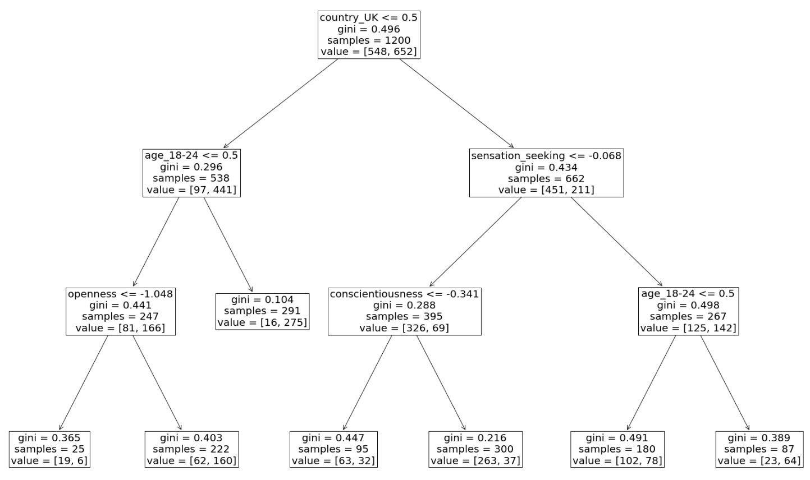
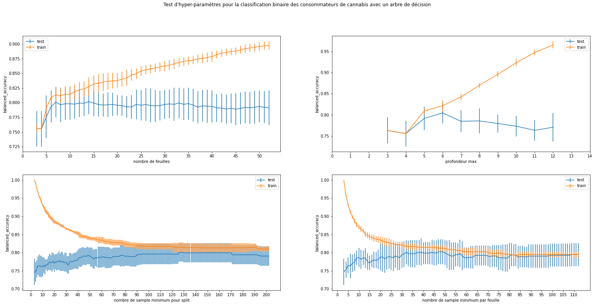
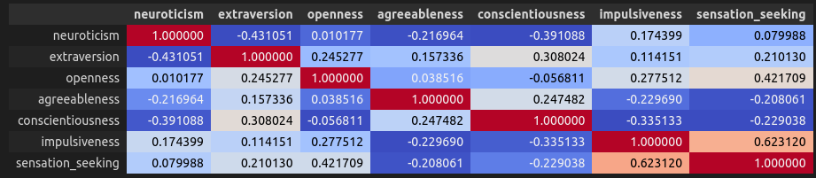
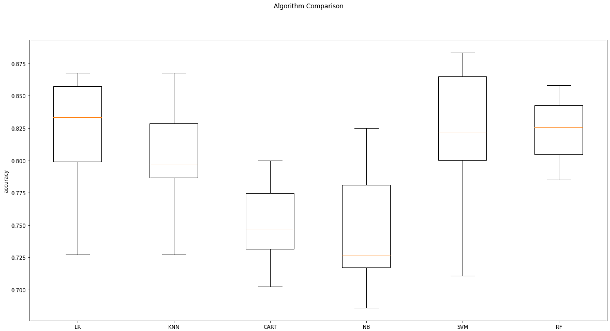
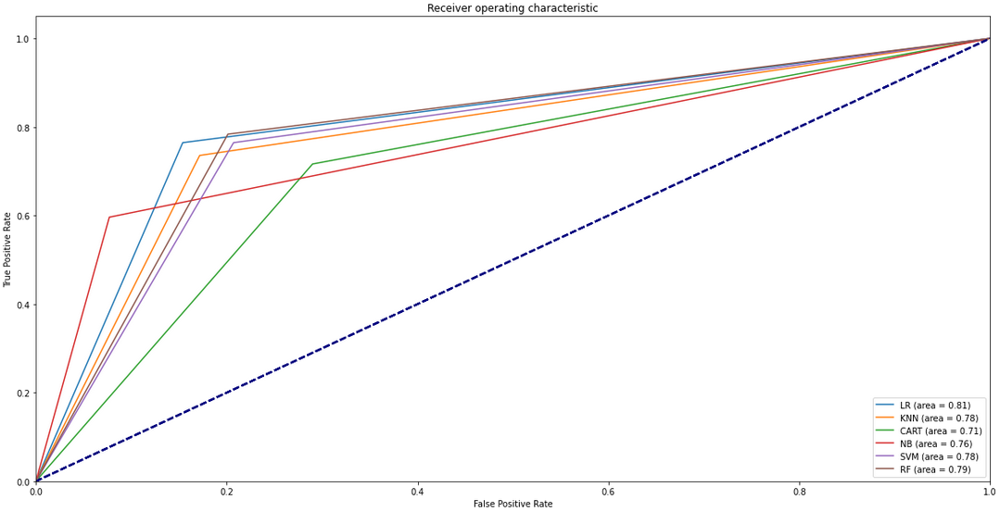
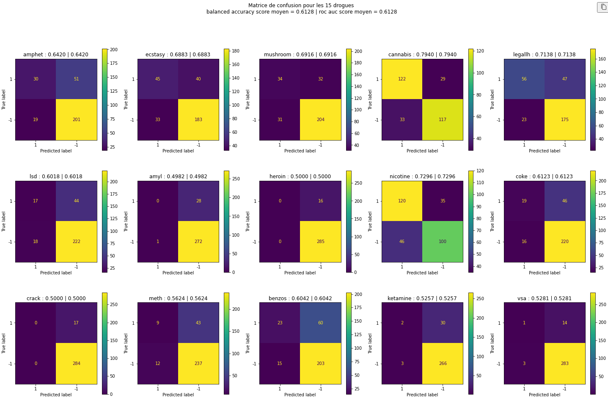
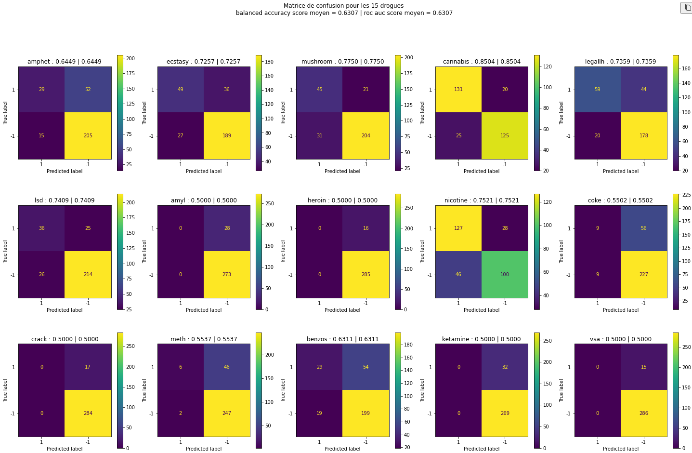
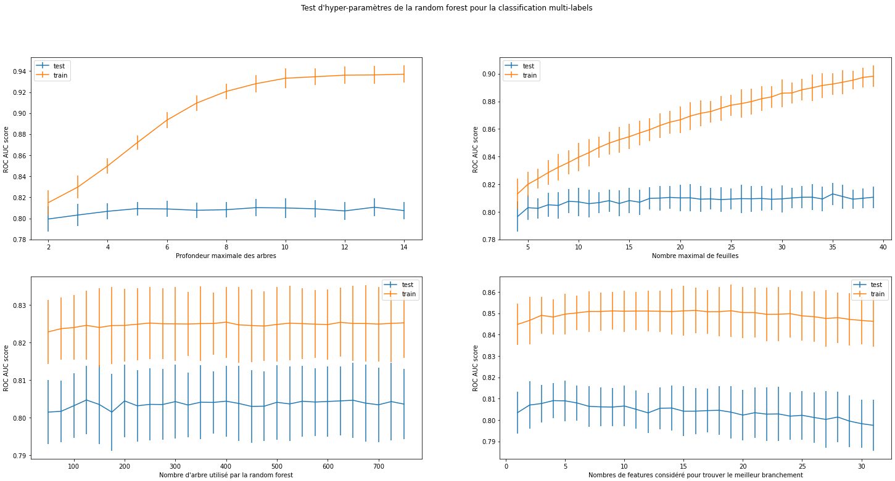

<script type="text/javascript" src="http://cdn.mathjax.org/mathjax/latest/MathJax.js?config=TeX-AMS-MML_HTMLorMML"></script>
<script type="text/x-mathjax-config"> MathJax.Hub.Config({ tex2jax: {inlineMath: [['$', '$']]}, messageStyle: "none" });</script>

# Projet d'IAS

### groupe
Arifette Nassim  
Derathe Pierre   
De Amorim Matthias  
Mesbah Slimane


## Introduction 
Dans ce projet, nous avons cherché à analyser et prédire la consommation de drogues chez les individus à partir d'un ensemble de données sur les caractéristiques démographiques et psychologiques. Ce rapport décrit en détail les différentes étapes de notre projet, y compris la préparation des données, l'exploration des données, la construction de modèles de prédiction et l'évaluation de leur performance.

## Présentation du jeu de données
### Description des données
Le jeu de données est nommé Drug consumption (quantified) Data Set.
Link : <https://archive.ics.uci.edu/ml/datasets/Drug+consumption+%28quantified%29>  

Les colonnes de ce dataset correspondent à un ID et différentes caractéristiques des personnes ayant participé à l'étude : âge, genre, niveau d'éducation, pays de résidence, ethnicité ainsi que des résultats aux tests psychologiques NEO-FFI-R, BIS-11 et impSS. Ces tests permettent de mesurer les caractéristiques suivantes : névrosisme, extraversion, ouverture à l'expérience, agréabilité, conscienciosité, impulsivité et la recherche de sensation.\
Dans le jeu données toutes les valeurs sont des floats ce qui ne pose pas de problème pour certaines caractéristique comme les résultats aux tests psychologiques mais qui a moins de sens pour d'autres informations comme le genre ou le pays de résidence.

Parmi les personnes ayant participé à l'étude, il y a un nombre équivalent d'hommes et de femmes. On peut voir que les jeunes sont plus représenté avec environ un tiers des participants ayant entre 18 et 24 ans. Ces personnes viennent majoritairement du Royaume-Unis et des Etats-Unis (respectivement 55% et 30% des personnes). En observant le niveau d'études des participants, on se rend compte que peu on arrêté les cours à 18 ans ou avant, la majorité ont été jusqu'à l'université. Les résultats des tests psychologiques semble plus dure à analyser, en traçant des histogramme on peut tout de même voir que la distribution des résultats ressemble à des gaussiennes.

Il y a en plus de cela 19 colonnes qui nous donnent des informations sur la consommation de différentes drogues, dont une drogue fictive. Pour chaque drogue, on sait si la personne ne la jamais consommé, en a consommé il y a plus de dix ans, consommé il y a moins de dix ans, moins d'un an, moins d'un mois, moins d'une semaine ou dans la dernière journée.\
Ces données là ne sont pas des floats mais des string de la forme CLx où x est remplacé par un chiffre indiquant une certaine classe (CL0 = n'a jamais consommé cette drogue, CL7 = en a consommé dans la journée).

### Présentations des tâches prévus

Notre dataset nous permettait d'aborder plusieurs problèmes de classifications différents.
Nous avons décider de d'abord effectuer une classification binaire sur une drogue (le cannabis) pour savoir si une personne est consommatrice ou non.\
Ensuite nous souhaitions réaliser une classification multilabel permettant de savoir si une personne consomme ou non chacune des drogues.\
Dans tous les cas, nous n'allons pas gérer la date de la consommation (CLx, comme expliqué dans la partie précédente).


## Préprocessing
Pour commencer nous avons commencer par enlever les colonnes ID, ainsi que la colonne "ethnicity" pour des raisons d'éthique.\
Ensuite, les lignes des personnes ayant répondu qu'ils consommaient la drogue Semeron. En effet, cette drogue fictive a été rajouté pour pouvoir repérer certains menteurs qui annonceraient qu'ils consomment plus qu'en réalité. 

Nous avons remplacé les strings dans les colonnes des drogues par des -1 et des 1. La valeur -1 correspond aux non consommateurs et 1 correspond aux consommateurs. Nous avons décidé de considérer comme consommatrice une personne ayant consommé la drogue durant la dernière année.

Ensuite nous avons décidé d'appliquer un one hot à certaines colonnes. Nous avions d'abord pensé ne faire que les colonnes genre et pays mais après plusieurs tests, nous avons décider d'aussi le faire pour les colonnes age et niveau d'éducation. Pour ces deux dernières colonnes nous pensions au départ que conservé un certain ordre avec des floats serait utile. Cependant après quelques tests, nous nous sommes rendu compte que les models performaient mieux avec un one hot sur ces colonnes.

Nous avons aussi appliquer une fonction permettant de standardiser toutes nos valeurs pour essayer d'avoir de meilleurs résultats.

Comme nous l'avons remarqué lors de la visualisation des données, certaines valeurs semblaient être en majorité par rapport à d'autres. Par exemple le nombre d'individus vivant aux USA ou en UK est bien plus important que les individus vivant en Nouvelle-Zélande par exemple. Dans ce genre de cas, le modèle peut avoir du mal à apprendre. Nous avons donc décider de fusionner certaines valeurs : 

```py
df_cannabis["country"] = df_cannabis["country"].replace(["Other", "Canada", "Australia", "New Zealand", "Republic of Ireland"], "Other")


df_cannabis["education"] = df_cannabis["education"].replace(["left school at 18", "left school at 16", "left school at 17", "left school before 16"], "left school before 18 (included)")

df_cannabis["age"] = df_cannabis["age"].replace(["45-54", "55-64", "65+"], "55+")
```
Exemple : 

| country             | before | after |
|---------------------|--------|-------|
| UK                  | 1044   | 1044  |
| USA                 | 551    | 551   |
| Other               | 118    | 282   |
| Canada              | 87     | 0     |
| Australia           | 52     | 0     |
| Republic of Ireland | 20     | 0     |
| New Zealand         | 5      | 0     |

Cependant il semblerait que cela augmente l'overfitting de notre modèle.

## Arbre de décision

L'arbre de décision est un algorithme de classification. Il consiste a créé des noeuds. Chaque noeud pose un seuil sur une feature qui sépare les données en deux. Avec les hyper paramètres que nous avons utilisé, ce seuil est définie en parcourant toutes les features pour trouver la meilleur séparation, c'est-à-dire, dans le cas de notre classification binaire, le plus de consommateurs et le moins de non-consommateurs d'un côté et inversement de l'autre côté. Ces noeuds permettent de classer les données dans différentes feuilles où l'ont peut supposer la classe des données dedans.

Il faut faire attention car les Arbres de décision ont tendance à faire de l'overfitting.

## Classification binaire pour une drogue

Nous avons choisi de réaliser notre classification binaire avec le cannabis car c'est la drogue pour laquelle le nombre de consommateurs est le plus proche du nombre de non consommateurs. Nous nous sommes donc dit que ce serait plus pratique pour pouvoir avoir un model efficace.  

Nous avons choisi d'utiliser un arbre de décision pour effectuer cette classification car on peut facilement visualiser les différents branchement.  
Nous avons effectuez une séparation du dataset en conservant 20% des données pour le test final et 80% pour l'entrainement et la validation.  


### Choix de la métrique

Dans le cadre d'une classification binaire plusieurs métriques sont possibles: precision , accuracy, sensitivity, specitificity.
On note: TP(resp FP) les vrais(resp faux) positifs, TN(resp FN) les vrais(resp faux) négatifs,
$$Sensitivity = TP/(TP+FN)$$ 
et 
$$Specitfity = TN/(TN+FP)$$ 

Dans notre cas, nous avons choisi la balanced accuracy score :
$$Balanced Accuracy = \frac{(Sensitivity + Specificity)}{2}$$  

Ce choix de score s'explique par le fait que, par précaution, même si les données sont équilibrées, il s'avère que cela est la meilleure métrique, au pire si elles sont balancées cela revient au même que d'utiliser l'accuracy score classique.

Une autre métrique intéressante que nous avons utilisé est l'aire sous la courbe ROC. Elle mesure la capacité d'un modèle à classer correctement des exemples positifs et négatifs à travers différents seuils de classification. L'aire sous la courbe ROC (AUC) est un résumé de la performance du modèle sur l'ensemble des seuils possibles. L'AUC varie de 0 à 1, où une valeur de 1 indique une performance parfaite et une valeur de 0,5 représente un modèle aléatoire.

La courbe ROC est construite en traçant le taux de vrais positifs (sensitivity) en fonction du taux de faux positifs (1 - specificity) pour différents seuils de décision. Le taux de vrais positifs (TPR) est défini comme suit :

$$TPR = TP / (TP + FN)$$


$$FPR = FP / (FP + TN)$$

L'AUC est calculée en intégrant la courbe ROC, c'est-à-dire en calculant l'aire sous la courbe formée par les points (FPR, TPR) pour tous les seuils de classification possibles.

La ROC_AUC est utile comme métrique pour la classification binaire, car elle fournit une mesure globale de la performance d'un modèle sur l'ensemble des seuils de classification, ce qui permet de comparer facilement différents modèles. Elle est particulièrement utile lorsque les classes sont déséquilibrées (par exemple, beaucoup plus d'exemples négatifs que positifs) ou lorsque les coûts de classification incorrecte sont très différents pour les deux classes. Dans de telles situations, la précision globale ou le F1-score peuvent ne pas refléter correctement les performances du modèle.

### Résultat du modèle 


Nous avons ensuite fait des tests d'hyper-paramètres avec de la cross-validation pour essayer de trouver quelle manière de limiter la taille de l'arbre était la plus efficace. Cependant quelque soit le paramètre choisi, on restait à un score de balanced accuracy d'environ 0.80, seul l'overfitting variait. 



Nous n'avons donc pas réussi à améliorer notre model plus que cela et nous nous sommes demandé si avec un autre modèle nous aurions pu avoir de meilleurs résultats.


Nous remarquons tout de même plusieurs choses par la lecture de l'arbre de décision.
Les features qui semblent être intéressantes sont la position géographique, l'âge et la recherche de sensation de l'individu.


## Analyse plus avancé des données  

Après n'avoir pas réussi à obtenir de meilleur résultat avec notre premier model, nous avons réaliser de nouvelles analyses des données.  

Nous avons d'abord réalisé une matrice de corrélation qui nous a permis de voir que la plupart des résultat des tests psychologiques n'étaient que peu corrélés entre eux. Les plus importantes corrélations étaient entre l'impulsivité et la recherche de sensation ainsi que entre l'ouverture à l'expérience et la recherche de sensation. On pouvait aussi voir que le névrosisme et l'extraversion était plutôt inversement corréler.  



Nous avons ensuite observé la corrélation entre chacune des caractéristique et la consommation de cannabis. Ces corrélations correspondaient aux branchement que nous avions avec l'arbre de décision.  

Après cela, nous avons comparé différent modèles et nous avons pu observé qu'utiliser un arbre de décision pour réaliser cette classification n'était pas le meilleur choix. Utiliser une random forest ou une régression logistique aurait été plus efficace.



Random Forest utilise le principe de Decision Tree dans son fonctionnement. Il va créé de nombreux arbres de décision puis faire la moyenne de chaque arbre pour parvenir à un résultat. Ceci dit, chaque arbre sera différent car les données d'entrée de chacun seront différente et que à la place de parcourir toutes les features à chaque noeud, seul une partie sera exploré. Ce modèle peut limiter l'overfitting possible du décision tree.




La courbe ROC nous permet d'avoir une autre perspective sur les modèles par rapport à un modèle complètement aléatoire (en pointillé).


## Classification multi label

Pour réaliser une classification multi label, nous avons décider de nous occuper uniquement des 15 drogues illégales. Nous avons donc retirer les drogues suivantes : chocolat, cafféine et alcohol ainsi que semeron puisque ce n'est pas une vraie drogue.  

Nous avons d'abord fait la classification avec un arbre de décision car cet algorithme peut traiter une target multilabel. En effet, les noeuds vont chercher à trouver la meilleur séparation en regardant tous les labels. La conséquence que l'ont va observer est que les labels déséquilibrés vont être mal prédits.

De plus, nous pourrons comparer nos résultats avec la classification bianaire fait précédemment. Pour afficher nos résultats, nous avons choisi de faire une matrice de confusion par drogue ainsi que de calculer les roc auc score et balanced accuracy score moyens. 


Nous avons obtenue une balanced accuracy de 0.62. Il n'y avait que quelques drogues qui étaient pas trop mal classé. Certaines drogues pour lesquelles il y a très peu de consommateurs n'étaient pas vraiment classé, tous les échantillons étaient considéré comme non-consommateur.  



Nous avons ensuite fait la classification avec une random forest puisque cela semblait être un des meilleurs modèles selon nos analyses précédentes et qu'elle utilise encore des arbres de décisions. Nous nous sommes aussi dit que le hasard qu'apportait la random forest permettrait peut-être de moins être affecté par le problème d'équilibrage entre les consommateurs et les non-consommateurs de certaines drogues.  
Avec la random forest nous restions à un balanced accuracy score d'environ 0.63 donc nous avons réaliser des tests d'hyper-paramètres pour essayer d'améliorer nos résultats mais les différents tests ne permettaient pas d'améliorer le score de manière remarquable, juste de connaître l'overfitting.  





On observe un overfitting significatif.

## Conclusion

Nous pensons que si nous avions réalisé un modèle de classification binaire pour chacune des drogues, nous aurions probablement pu obtenir de meilleurs résultats. Cependant, cette approche aurait été beaucoup plus longue et coûteuse en termes de temps et de ressources.

En conclusion, bien que la classification multi-label pour plusieurs drogues ait présenté des défis, notamment en raison du déséquilibre entre les consommateurs et les non-consommateurs pour certaines drogues, les modèles de forêt aléatoire ont permis d'obtenir des résultats légèrement meilleurs que les arbres de décision. Il pourrait être intéressant d'explorer d'autres modèles ou approches pour améliorer davantage la performance de la classification multi-label notamment le boosting ou l'apprentissage ensembliste.

Cependant ces deux derniers aurait demandé des explications fournies car nous n'avons pas vu ces deux méthodes en cours. Cependant en général, ces deux méthodes fournissent de bien meilleurs résultats.

